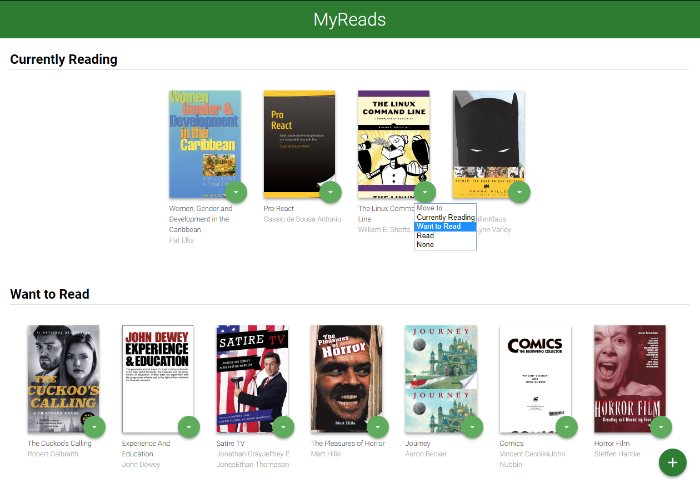
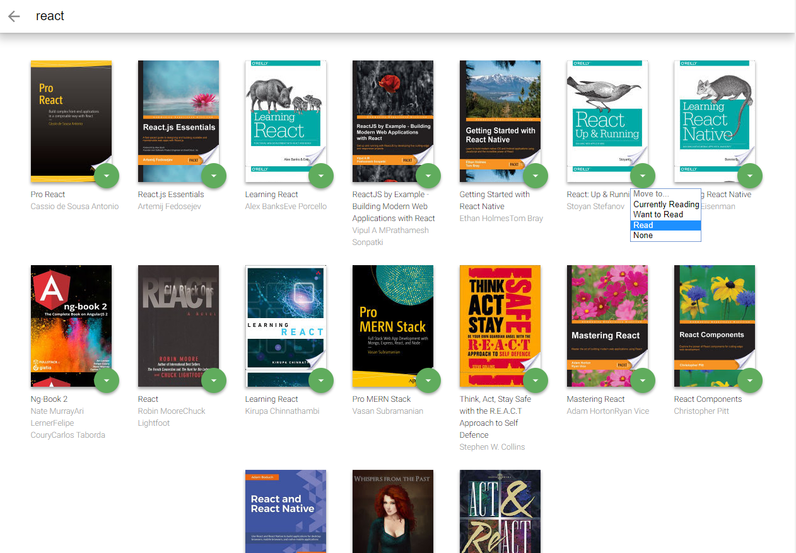

# MyReads Project

Udacity Front-End Developer Nanodegree project. The project emphasizes using React to build the application and provides an API server and client library that you will use to persist information as you interact with the application. The goal of the application is to help you manage the state of a list of books.

## Table of Contents

- [MyReads Project](#myreads-project)
  - [Table of Contents](#table-of-contents)
  - [Task](#task)
  - [App Functionality](#app-functionality)
    - [Main View](#main-view)
    - [Search View](#search-view)
    - [Demo](#demo)
  - [Technology](#technology)
  - [Project Instructions](#project-instructions)
    - [Dependencies](#dependencies)
    - [Server](#server)
  - [Structure](#structure)
  - [Backend Server](#backend-server)
    - [`getAll`](#getall)
    - [`update`](#update)
    - [`search`](#search)
  - [Deployment](#deployment)
  - [Contributing](#contributing)
  - [Contact / Social Media](#contact--social-media)
    - [License](#license)

## Task

I create a Bookshelf App that allows you to select and categorize books you are __"Currently Reading"__, __"Want to Read"__ and __Read"__. This project was bootstrapped with [Create React App](https://github.com/facebookincubator/create-react-app).


## App Functionality

### Main View

The main page displays a list of "shelves" (i.e. categories), each of which contains a number of books. The three shelves are:

- Currently Reading
- Want to Read
- Read

To move a book's to a different shelf category or to remove a book from the list, click on the green button on the book cover. When the browser is refreshed, the same information is displayed on the page.

### Search View

The search view is used add new books to your shelves. Using `+` button on the main page will take you to the search view.

The search page has a search input field. As the user types into the search field, books that match the query are displayed on the page. Books can be searched by title or author.

Results on the search page allow the user to select a shelf category. If a book is assigned to a shelf on the main page and that book will appear on the search page. Clicking on the green button on the book cover will display the current assign shelf if any. User will be able move the book to a different shelf category or to remove a book from the main page list. When an item is categorized on the search page, and the user navigates to the main page, it appears on that shelf in the main page.

__Note__: The backend API uses a fixed set of cached search results and is limited to a particular set of search terms, which can be found in [SEARCH_TERMS.md](SEARCH_TERMS.md). That list of terms are the _only_ terms that will work with the backend, so don't be surprised if your searches for Basket Weaving or Bubble Wrap don't come back with any results.

### Demo

Take a look a the React Bookshelf App
- [MyReads App](https://javavista.github.io/Project-MyReads/#/)

## Technology

- JavaScript
  - ES6
- [ReactJS](https://reactjs.org/)
- [React Router](https://reacttraining.com/react-router/)

## Project Instructions

To view the code and make changes:

- Fork the repository.
- Download the repository to your computer.

### Dependencies

Install all project dependencies with `npm install`. You can also use `yarn install`. You will need [`react-router-dom`](https://www.npmjs.com/package/react-router-dom) to control navigational routing. To install run `npm install --save react-router-dom`

### Server

Start the development server with `npm start`. You can also use `yarn start`.


## Structure

```bash
├── CONTRIBUTING.md
├── README.md - This file.
├── SEARCH_TERMS.md # The whitelisted short collection of available search terms for you to use with your app.
├── package.json # npm package manager file.
├── public
│   ├── favicon.ico # React Icon.
│   └── index.html
└── src
    ├── App.css # Styles for your app.
    ├── App.js # This is the root of your app.
    ├── App.test.js # Used for testing. Provided with Create React App.
    ├── BooksAPI.js # A JavaScript API for the provided Udacity backend. Descriptions for the methods are below.
    ├── icons # Helpful images for your app.
    │   ├── add.svg
    │   ├── arrow-back.svg
    │   └── arrow-drop-down.svg
    ├── components # Components states are passed down from parent components to child components.
    │   ├── Book.js
    │   ├── Main.js
    │   ├── Search.js
    │   └── Shelf.js
    ├── index.css # Global styles.
    └── index.js # Used for DOM rendering only.
```


## Backend Server

To simplify your development process, we've provided a backend server for you to develop against. The provided file [`BooksAPI.js`](src/BooksAPI.js) contains the methods you will need to perform necessary operations on the backend:

* [`getAll`](#getall)
* [`update`](#update)
* [`search`](#search)

### `getAll`

Method Signature:

```js
getAll()
```

* Returns a Promise which resolves to a JSON object containing a collection of book objects.
* This collection represents the books currently in the bookshelves in your app.

### `update`

Method Signature:

```js
update(book, shelf)
```

* book: `<Object>` containing at minimum an `id` attribute
* shelf: `<String>` contains one of ["wantToRead", "currentlyReading", "read"]
* Returns a Promise which resolves to a JSON object containing the response data of the POST request

### `search`

Method Signature:

```js
search(query)
```

* query: `<String>`
* Returns a Promise which resolves to a JSON object containing a collection of a maximum of 20 book objects.
* These books do not know which shelf they are on. They are raw results only. You'll need to make sure that books have the correct state while on the search page.


## Deployment

`npm run build` creates a `build` directory with a production build of your app. Set up your favorite  HTTP server so that a visitor to your site is served `index.html`.

## Contributing

This repository is the starter code for _all_ Udacity students. Therefore, we most likely will not accept pull requests.

For details, check out [CONTRIBUTING.md](CONTRIBUTING.md).

## Contact / Social Media

- Twitter – [@seetechnologic](https://twitter.com/seetechnologic)
- GitHub - [https://github.com/JavaVista/](https://github.com/JavaVista/)
- LinkedIn - [Javier Carrion](https://www.linkedin.com/in/technologic)

### License

Distributed under the MIT License. Note: Copyright and license text of third party modules are included in their source code.

See the [](LICENSE.md)
for more information.